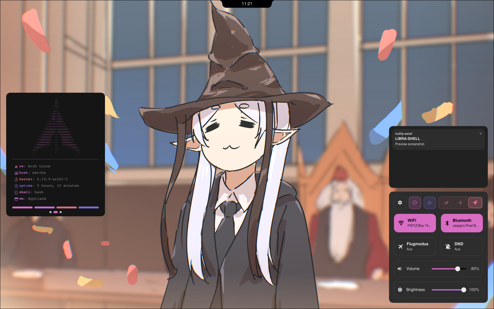
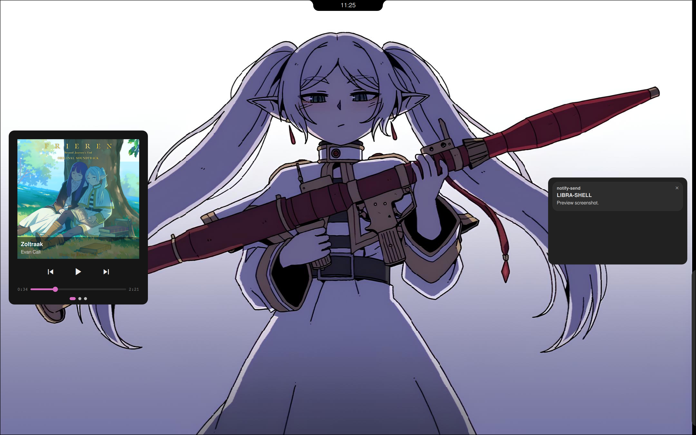
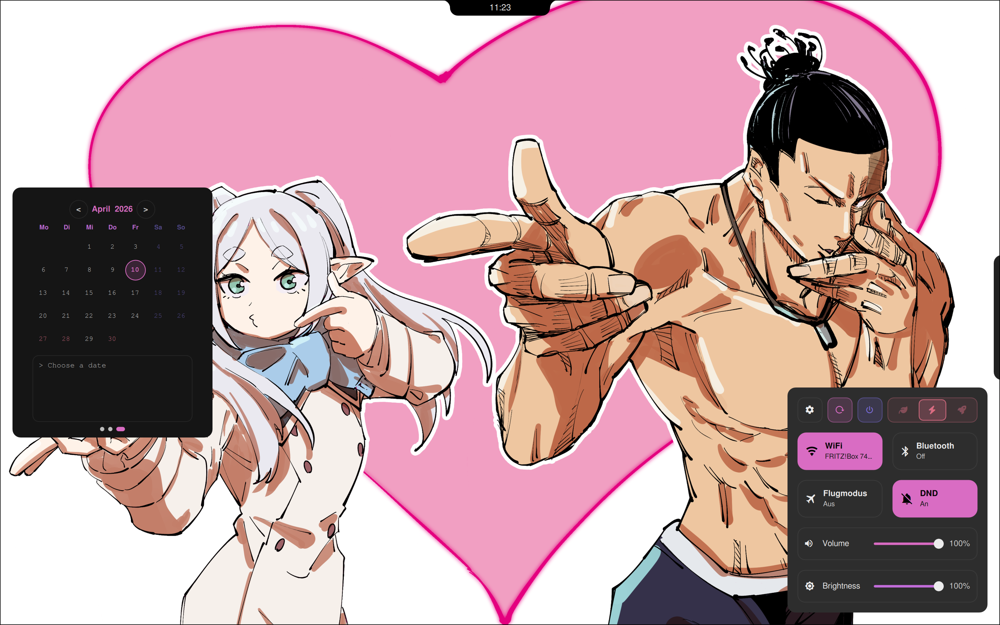

# ⚖ LIBRA-SHELL ⚖

 

*a panel-based, non-distracting quickshell configuration*

## Roadmap

| Status | Feature |
|---|---|
| open | generalsettings |
| open | new wallpapertool design |
| idea | musicwidget = vinylplayer |
| idea | soundsettings with tuner |
| idea | new panel for hyprland features |

## Preview

  
  
  

## Requirements

| Package | Description |
|---|---|
| Hyprland | Wayland compositor |
| Quickshell | QML shell framework |

## Contributing

Ideas, issues and pull requests are welcome.

*Built with caffeine and too many hours staring at QML.*

⚖

